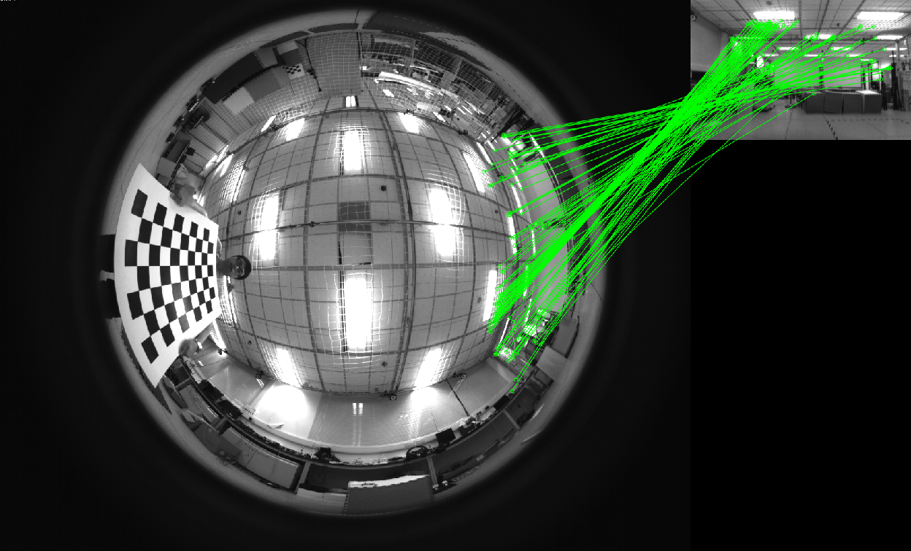
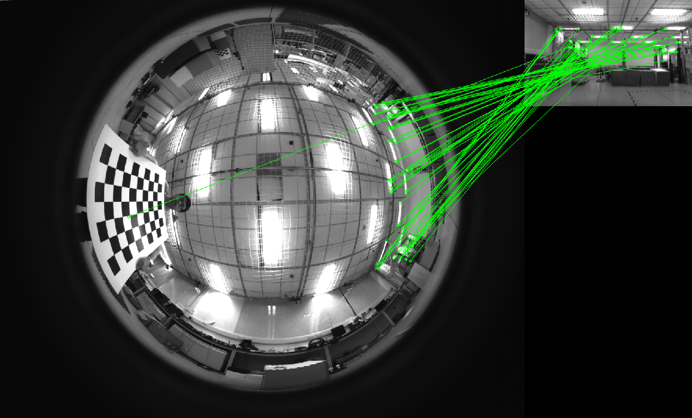

# FSF
a feature detector for omnidirectional and fisheye cameras.

## Feature Type Performance

Feature Type | FSF | BRISK | ORB | FREAK(FAST)
--- | --- | --- | --- | ---
Number | 391 | 91 | 555 | 156
Number (RANSAC) | 170 | 64 | 92 | 101

FSF:

ORB:

FREAK(FAST):

BRISK:

