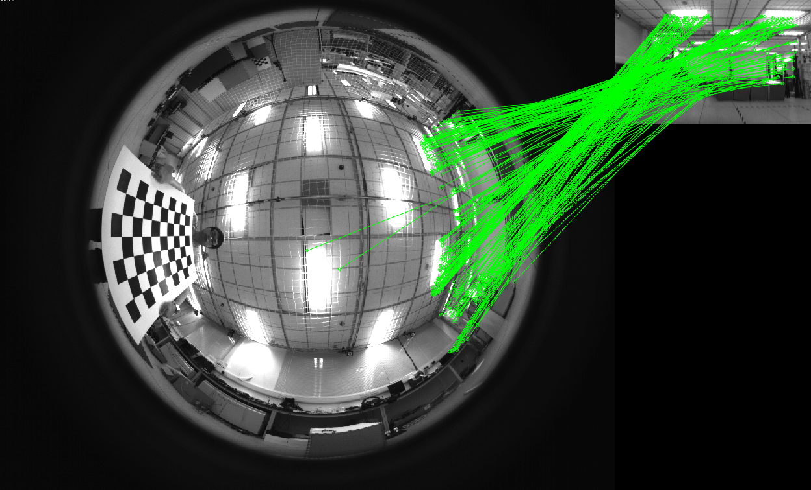

# FSR : Fast Spherical Retina Keypoint

Fast Spherical Retina Keypoint, a feature detector, and descriptor for the image with huge distortion, such as ultra-wide the filed-of-view fisheye cameras and omnidirectional cameras.

## Feature Type Performance

Feature Type | FSRK | BRISK | ORB | FREAK(FAST)
--- | --- | --- | --- | ---
Number | 406 | 91 | 555 | 156
Number (RANSAC) | 217 | 64 | 92 | 101

FSRK:

ORB:

FREAK(FAST):

BRISK:

